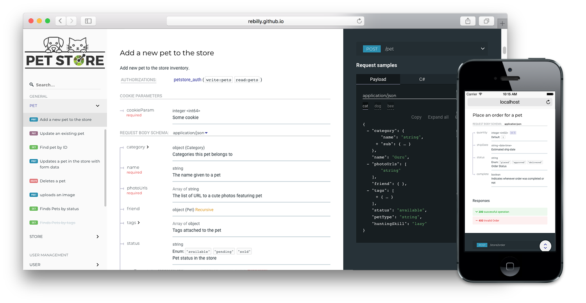
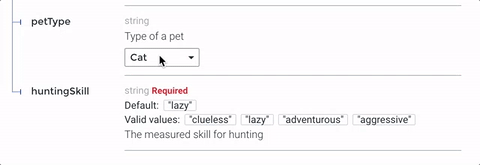
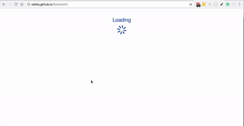

# ReDoc
**OpenAPI/Swagger-generated API Reference Documentation**

[](https://travis-ci.org/Rebilly/ReDoc) [](https://coveralls.io/github/Rebilly/ReDoc?branch=master) [](https://APIs.guru) [](https://gemnasium.com/github.com/Rebilly/ReDoc)  [](https://waffle.io/Rebilly/ReDoc)

[](http://isitmaintained.com/project/Rebilly/redoc "Average time to resolve an issue") [](http://isitmaintained.com/project/REBILLY/REDOC "Percentage of issues still open")

[](https://www.npmjs.com/package/redoc) [](http://bower.io/) [](https://github.com/Rebilly/ReDoc/blob/master/LICENSE)

[](https://saucelabs.com/u/redoc)



## [Live demo](http://rebilly.github.io/ReDoc/)

[](https://github.com/Rebilly/generator-openapi-repo#generator-openapi-repo--)

## Features
- Extremely easy deployment
- The widest OpenAPI features support (yes, it supports even `discriminator`) <br>

- Neat **interactive** documentation for nested objects <br>

- Code samples support (via vendor extension) <br>

- Progressive loading with `lazy-rendering` options <br>

- Responsive three-panel design with menu/scrolling synchronization
- Integrate API Introduction into side menu - ReDoc takes advantage of markdown headings from OpenAPI description field. It pulls them into side menu and also supports deep linking.
- High-level grouping in side-menu via [`x-tagGroups`](docs/redoc-vendor-extensions.md#x-tagGroups) vendor extension
- Multiple ReDoc instances on single page ([example](demo/examples/multiple-apis/index.html))

## Roadmap
  - [x] ~~performance optimizations~~
  - [x] ~~better navigation (menu improvements + search)~~
  - [ ] ability to simple branding/styling
  - [ ] built-in API Console
  - [ ] docs pre-rendering (performance and SEO)

## Releases
We host the latest and all the previous ReDoc releases on GitHub Pages-based **CDN**:
- particular release, e.g. `v1.2.0`: https://rebilly.github.io/ReDoc/releases/v1.2.0/redoc.min.js
- `v1.x.x` release: https://rebilly.github.io/ReDoc/releases/v1.x.x/redoc.min.js
- `latest` release: https://rebilly.github.io/ReDoc/releases/latest/redoc.min.js this file is updated with each release of ReDoc and may introduce breaking changes. **Not recommended to use in production.** Use particular release or `v1.x.x`.

## Some Real-life usages
- [Rebilly](https://rebilly.github.io/RebillyAPI)
- [Docker Engine](https://docs.docker.com/engine/api/v1.25/)
- [Zuora](https://www.zuora.com/developer/api-reference/)
- [Shopify Draft Orders](https://help.shopify.com/api/draft-orders)
- [Discourse](https://docs.discourse.org)
- [APIs.guru](https://apis.guru/api-doc/)

## Deployment

### TL;DR

```html
<!DOCTYPE html>
<html>
  <head>
    <title>ReDoc</title>
    <!-- needed for adaptive design -->
    <meta charset="utf-8"/>
    <meta name="viewport" content="width=device-width, initial-scale=1">

    <!--
    ReDoc doesn't change outer page styles
    -->
    <style>
      body {
        margin: 0;
        padding: 0;
      }
    </style>
  </head>
  <body>
    <redoc spec-url='http://petstore.swagger.io/v2/swagger.json'></redoc>
    <script src="https://rebilly.github.io/ReDoc/releases/latest/redoc.min.js"> </script>
  </body>
</html>
```
That's all folks!

### 1. Install ReDoc (skip this step for CDN)
Install using [bower](bower.io):

    bower install redoc

or using [npm](https://docs.npmjs.com/getting-started/what-is-npm):

    npm install redoc --save

### 2. Reference redoc script in HTML
For **CDN**:
```html
<script src="https://rebilly.github.io/ReDoc/releases/latest/redoc.min.js"> </script>
```

For bower:
```html
<script src="bower_components/redoc/dist/redoc.min.js"> </script>
```
For npm:
```html
<script src="node_modules/redoc/dist/redoc.min.js"> </script>
```

### 3. Add `<redoc>` element to your page
```html
<redoc spec-url="url/to/your/spec"></redoc>
```

### 4. Enjoy :smile:

## Configuration

### Security Definition location
You can inject Security Definitions widget into any place of your specification `description`. Check out details [here](docs/security-definitions-injection.md).

### Swagger vendor extensions
ReDoc makes use of the following [vendor extensions](http://swagger.io/specification/#vendorExtensions):
* [`x-logo`](docs/redoc-vendor-extensions.md#x-logo) - is used to specify API logo
* [`x-traitTag`](docs/redoc-vendor-extensions.md#x-traitTag) - useful for handling out common things like Pagination, Rate-Limits, etc
* [`x-code-samples`](docs/redoc-vendor-extensions.md#x-code-samples) - specify operation code samples
* [`x-nullable`](docs/redoc-vendor-extensions.md#nullable) - mark schema param as a nullable
* [`x-displayName`](docs/redoc-vendor-extensions.md#x-displayname) - specify human-friendly names for the menu categories
* [`x-tagGroups`](docs/redoc-vendor-extensions.md#x-tagGroups) - group tags by categories in the side menu
* [`x-servers`](docs/redoc-vendor-extensions.md#x-servers) - ability to specify different servers for API (backported from OpenAPI 3.0)

### `<redoc>` tag attributes
* `spec-url` - relative or absolute url to your spec file;
* `scroll-y-offset` - If set, specifies a vertical scroll-offset. This is often useful when there are fixed positioned elements at the top of the page, such as navbars, headers etc;
`scroll-y-offset` can be specified in various ways:
  * **number**: A fixed number of pixels to be used as offset;
  * **selector**: selector of the element to be used for specifying the offset. The distance from the top of the page to the element's bottom will be used as offset;
  * **function**: A getter function. Must return a number representing the offset (in pixels);
* `suppress-warnings` - if set, warnings are not rendered at the top of documentation (they still are logged to the console).
* `lazy-rendering` - if set, enables lazy rendering mode in ReDoc. This mode is useful for APIs with big number of operations (e.g. > 50). In this mode ReDoc shows initial screen ASAP and then renders the rest operations asynchronously while showing progress bar on the top. Check out the [demo](\\rebilly.github.io/ReDoc) for the example.
* `hide-hostname` - if set, the protocol and hostname is not shown in the method definition.
* `expand-responses` - specify which responses to expand by default by response codes. Values should be passed as comma-separated list without spaces e.g. `expand-responses="200,201"`. Special value `"all"` expands all responses by default. Be careful: this option can slow-down documentation rendering time.
* `required-props-first` - show required properties first ordered in the same order as in `required` array.

## Advanced usage
Instead of adding `spec-url` attribute to the `<redoc>` element you can initialize ReDoc via globally exposed `Redoc` object:
```js
Redoc.init(specUrl, options)
```

`options` is javascript object with camel-cased version of `<redoc>` tag attribute names as the keys, e.g.:
```js
Redoc.init('http://petstore.swagger.io/v2/swagger.json', {
  scrollYOffset: 50
})
```

-----------
## Development
#### Running local dev-server
- Clone repository
`git clone https://github.com/Rebilly/ReDoc.git`
- Go to the project folder
`cd ReDoc`
- Install dependencies
`npm install`
- _(optional)_ Replace `demo/swagger.yaml` with your own schema
- Start the server
`npm start`
- Open `http://localhost:9000`

Alternatively, Docker can be used by just running `docker-compose up`.
