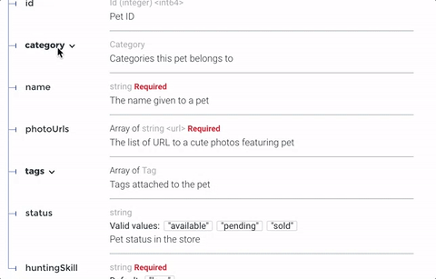
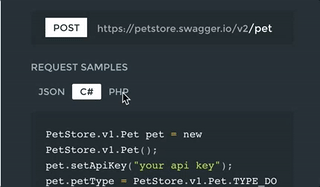

<div align="center">
  

  **OpenAPI/Swagger-generated API Reference Documentation**

  [](https://travis-ci.org/Redocly/redoc) [](https://coveralls.io/github/Redocly/redoc?branch=master) [](https://david-dm.org/Redocly/redoc) [](https://david-dm.org/Redocly/redoc#info=devDependencies) [](https://www.npmjs.com/package/redoc) [](https://github.com/Redocly/redoc/blob/master/LICENSE)

  [](https://cdn.jsdelivr.net/npm/redoc/bundles/redoc.standalone.js) [](https://www.npmjs.com/package/redoc) [](https://www.jsdelivr.com/package/npm/redoc) [](https://hub.docker.com/r/redocly/redoc/)


</div>

**This is README for `2.0` version of ReDoc (React based). README for `1.x` version is on the branch [v1.x](https://github.com/Redocly/redoc/tree/v1.x)**


## [Live demo](http://redocly.github.io/redoc/)

[](https://github.com/Rebilly/generator-openapi-repo#generator-openapi-repo--) [](https://redoc.ly) [](https://redoc.ly/#services)

## Features
- Extremely easy deployment
- [redoc-cli](https://github.com/Redocly/redoc/blob/master/cli/README.md) with ability to bundle your docs into **zero-dependency** HTML file
- Server Side Rendering ready
- The widest OpenAPI v2.0 features support (yes, it supports even `discriminator`) <br>

- OpenAPI 3.0 support
- Neat **interactive** documentation for nested objects <br>

- Code samples support (via vendor extension) <br>

- Responsive three-panel design with menu/scrolling synchronization
- Integrate API Introduction into side menu - ReDoc takes advantage of markdown headings from OpenAPI description field. It pulls them into side menu and also supports deep linking.
- High-level grouping in side-menu via [`x-tagGroups`](docs/redoc-vendor-extensions.md#x-tagGroups) vendor extension
- Simple integration with `create-react-app` ([sample](https://github.com/APIs-guru/create-react-app-redoc))
- Branding/customizations via [`theme` option](#redoc-options-object)

## Roadmap
  - [x] ~~[OpenAPI v3.0 support](https://github.com/Redocly/redoc/issues/312)~~
  - [x] ~~performance optimizations~~
  - [x] ~~better navigation (menu improvements + search)~~
  - [x] ~~React rewrite~~
  - [x] ~~docs pre-rendering (performance and SEO)~~
  - [ ] ability to simple branding/styling
  - [ ] built-in API Console

## Releases
**Important:** all the 2.x releases are deployed to npm and can be used via jsdeliver:
- particular release, e.g. `v2.0.0-alpha.15`: https://cdn.jsdelivr.net/npm/redoc@2.0.0-alpha.17/bundles/redoc.standalone.js
- `next` release: https://cdn.jsdelivr.net/npm/redoc@next/bundles/redoc.standalone.js

Additionally, all the 1.x releases are hosted on our GitHub Pages-based CDN **(deprecated)**:
- particular release, e.g. `v1.2.0`: https://rebilly.github.io/ReDoc/releases/v1.2.0/redoc.min.js
- `v1.x.x` release: https://rebilly.github.io/ReDoc/releases/v1.x.x/redoc.min.js
- `latest` release: https://rebilly.github.io/ReDoc/releases/latest/redoc.min.js - it will point to latest 1.x.x release since 2.x releases are not hosted on this CDN but on unpkg.

## Version Guidance
| ReDoc Release | OpenAPI Specification |
|:--------------|:----------------------|
| 2.0.0-alpha.x | 3.0, 2.0              |
| 1.19.x        | 2.0                   |
| 1.18.x        | 2.0                   |
| 1.17.x        | 2.0                   |

## Some Real-life usages
- [Rebilly](https://rebilly.github.io/RebillyAPI)
- [Docker Engine](https://docs.docker.com/engine/api/v1.25/)
- [Zuora](https://www.zuora.com/developer/api-reference/)
- [Shopify Draft Orders](https://help.shopify.com/api/draft-orders)
- [Discourse](http://docs.discourse.org)
- [APIs.guru](https://apis.guru/api-doc/)
- [FastAPI](https://github.com/tiangolo/fastapi)

## Deployment

### TL;DR

```html
<!DOCTYPE html>
<html>
  <head>
    <title>ReDoc</title>
    <!-- needed for adaptive design -->
    <meta charset="utf-8"/>
    <meta name="viewport" content="width=device-width, initial-scale=1">
    <link href="https://fonts.googleapis.com/css?family=Montserrat:300,400,700|Roboto:300,400,700" rel="stylesheet">

    <!--
    ReDoc doesn't change outer page styles
    -->
    <style>
      body {
        margin: 0;
        padding: 0;
      }
    </style>
  </head>
  <body>
    <redoc spec-url='http://petstore.swagger.io/v2/swagger.json'></redoc>
    <script src="https://cdn.jsdelivr.net/npm/redoc@next/bundles/redoc.standalone.js"> </script>
  </body>
</html>
```
That's all folks!

**IMPORTANT NOTE:** if you work with untrusted user spec, use `untrusted-spec` [option](#redoc-options-object) to prevent XSS security risks.

### 1. Install ReDoc (skip this step for CDN)
Install using [yarn](https://yarnpkg.com):

    yarn add redoc

or using [npm](https://docs.npmjs.com/getting-started/what-is-npm):

    npm install redoc --save

### 2. Reference redoc script in HTML
For **CDN**:
```html
<script src="https://cdn.jsdelivr.net/npm/redoc/bundles/redoc.standalone.js"> </script>
```

For npm:
```html
<script src="node_modules/redoc/bundles/redoc.standalone.js"> </script>
```

### 3. Add `<redoc>` element to your page
```html
<redoc spec-url="url/to/your/spec"></redoc>
```

### 4. Enjoy :smile:


## Usage as a React component

Install peer dependencies required by ReDoc if you don't have them installed already:

    npm i react react-dom mobx@^4.2.0 styled-components

Import `RedocStandalone` component from 'redoc' module:

```js
import { RedocStandalone } from 'redoc';
```

and use it somewhere in your component:

```js
<RedocStandalone specUrl="url/to/your/spec"/>
```

or

```js
<RedocStandalone spec={/* spec as an object */}/>
```

Also you can pass options:

```js
<RedocStandalone
  specUrl="http://rebilly.github.io/RebillyAPI/openapi.json"
  options={{
    nativeScrollbars: true,
    theme: { colors: { primary: { main: '#dd5522' } } },
  }}
/>
```

Here are detailed [options docs](#redoc-options-object).

You can also specify `onLoaded` callback which will be called each time Redoc has been fully rendered or when error occurs (with an error as the first argument). *NOTE*: It may be called multiply times if you change component properties

```js
<RedocStandalone
  specUrl="http://rebilly.github.io/RebillyAPI/openapi.json"
  onLoaded={error => {
    if (!error) {
      console.log('Yay!');
    }
  }}
/>
```

[**IE11 Support Notes**](docs/usage-with-ie11.md)

## The Docker way

ReDoc is available as pre-built Docker image in official [Docker Hub repository](https://hub.docker.com/r/redocly/redoc/). You may simply pull & run it:

    docker pull redocly/redoc
    docker run -p 8080:80 redocly/redoc

Also you may rewrite some predefined environment variables defined in [Dockerfile](./config/docker/Dockerfile). By default ReDoc starts with demo Petstore spec located at `http://petstore.swagger.io/v2/swagger.json`, but you may change this URL using environment variable `SPEC_URL`:

    docker run -p 8080:80 -e SPEC_URL=https://api.example.com/openapi.json redocly/redoc

## ReDoc CLI

[See here](https://github.com/Redocly/redoc/blob/master/cli/README.md)

## Configuration

### Security Definition location
You can inject Security Definitions widget into any place of your specification `description`. Check out details [here](docs/security-definitions-injection.md).

### Swagger vendor extensions
ReDoc makes use of the following [vendor extensions](https://swagger.io/specification/#specificationExtensions):
* [`x-logo`](docs/redoc-vendor-extensions.md#x-logo) - is used to specify API logo
* [`x-traitTag`](docs/redoc-vendor-extensions.md#x-traitTag) - useful for handling out common things like Pagination, Rate-Limits, etc
* [`x-code-samples`](docs/redoc-vendor-extensions.md#x-code-samples) - specify operation code samples
* [`x-examples`](docs/redoc-vendor-extensions.md#x-examples) - specify JSON example for requests
* [`x-nullable`](docs/redoc-vendor-extensions.md#nullable) - mark schema param as a nullable
* [`x-displayName`](docs/redoc-vendor-extensions.md#x-displayname) - specify human-friendly names for the menu categories
* [`x-tagGroups`](docs/redoc-vendor-extensions.md#x-tagGroups) - group tags by categories in the side menu
* [`x-servers`](docs/redoc-vendor-extensions.md#x-servers) - ability to specify different servers for API (backported from OpenAPI 3.0)
* [`x-ignoredHeaderParameters`](docs/redoc-vendor-extensions.md#x-ignoredHeaderParameters) - ability to specify header parameter names to ignore

### `<redoc>` options object
You can use all of the following options with standalone version on <redoc> tag by kebab-casing them, e.g. `scrollYOffset` becomes `scroll-y-offset` and `expandResponses` becomes `expand-responses`.

* `untrustedSpec` - if set, the spec is considered untrusted and all HTML/markdown is sanitized to prevent XSS. **Disabled by default** for performance reasons. **Enable this option if you work with untrusted user data!**
* `scrollYOffset` - If set, specifies a vertical scroll-offset. This is often useful when there are fixed positioned elements at the top of the page, such as navbars, headers etc;
`scrollYOffset` can be specified in various ways:
  * **number**: A fixed number of pixels to be used as offset;
  * **selector**: selector of the element to be used for specifying the offset. The distance from the top of the page to the element's bottom will be used as offset;
  * **function**: A getter function. Must return a number representing the offset (in pixels);
* `suppressWarnings` - if set, warnings are not rendered at the top of documentation (they still are logged to the console).
* `lazyRendering` - _Not implemented yet_ ~~if set, enables lazy rendering mode in ReDoc. This mode is useful for APIs with big number of operations (e.g. > 50). In this mode ReDoc shows initial screen ASAP and then renders the rest operations asynchronously while showing progress bar on the top. Check out the [demo](\\redocly.github.io/redoc) for the example.~~
* `hideHostname` - if set, the protocol and hostname is not shown in the operation definition.
* `expandResponses` - specify which responses to expand by default by response codes. Values should be passed as comma-separated list without spaces e.g. `expandResponses="200,201"`. Special value `"all"` expands all responses by default. Be careful: this option can slow-down documentation rendering time.
* `requiredPropsFirst` - show required properties first ordered in the same order as in `required` array.
* `sortPropsAlphabetically` - sort properties alphabetically
* `showExtensions` - show vendor extensions ("x-" fields). Extensions used by ReDoc are ignored. Can be boolean or an array of `string` with names of extensions to display
* `noAutoAuth` - do not inject Authentication section automatically
* `pathInMiddlePanel` - show path link and HTTP verb in the middle panel instead of the right one
* `hideLoading` - do not show loading animation. Useful for small docs
* `nativeScrollbars` - use native scrollbar for sidemenu instead of perfect-scroll (scrolling performance optimization for big specs)
* `hideDownloadButton` - do not show "Download" spec button. **THIS DOESN'T MAKE YOUR SPEC PRIVATE**, it just hides the button.
* `disableSearch` - disable search indexing and search box
* `onlyRequiredInSamples` - shows only required fields in request samples.
* `theme` - ReDoc theme. Not documented yet. For details check source code: [theme.ts](https://github.com/Redocly/redoc/blob/master/src/theme.ts)

## Advanced usage of standalone version
Instead of adding `spec-url` attribute to the `<redoc>` element you can initialize ReDoc via globally exposed `Redoc` object:
```js
Redoc.init(specOrSpecUrl, options, element, callback?)
```

- `specOrSpecUrl` is either JSON object with specification or an URL to the spec in `JSON` or `YAML` format
- `options` [options object](#redoc-options-object)
- `element` DOM element to put ReDoc into
- `callback` (optional) - callback to be called after Redoc has been fully rendered. It is also called also on errors with error as the first argument

```js
Redoc.init('http://petstore.swagger.io/v2/swagger.json', {
  scrollYOffset: 50
}, document.getElementById('redoc-container'))
```

-----------
## Development
see [CONTRIBUTING.md](.github/CONTRIBUTING.md)
